*NOTE:* This file is a template that you can use to create the README for your project. The *TODO* comments below will highlight the information you should be sure to include.


# Your Project Title Here

This Project is aimed at Operationalizing Machine Learning, by applying DevOps principles to Machine Learning, usually known as MLOPs. I will start by creating an ML model from the Bank Marketing dataset, from there I deploy the model, consume endpoint it and pipeline automation. it. 


## Architectural Diagram
*TODO*: Provide an architectual diagram of the project and give an introduction of each step. An architectural diagram is an image that helps visualize the flow of operations from start to finish. In this case, it has to be related to the completed project, with its various stages that are critical to the overall flow. For example, one stage for managing models could be "using Automated ML to determine the best model". 


1.  Authentication
2.  Automated ML Experiment
3. Deploy the best model
4. Enable logging
5. Swagger Documentation
6. Consume model endpoints
7. Create and publish a pipeline
8. Documentation


## Key Steps
*TODO*: Write a short discription of the key steps. Remeber to include all the screenshots required to demonstrate key steps. 

**Authentication**

Starts by creating a Service Principal(SP) account which is a user role that helps to control scope of permissions. Here, SP is assigned to  access the "Bank-mkt" workspace.
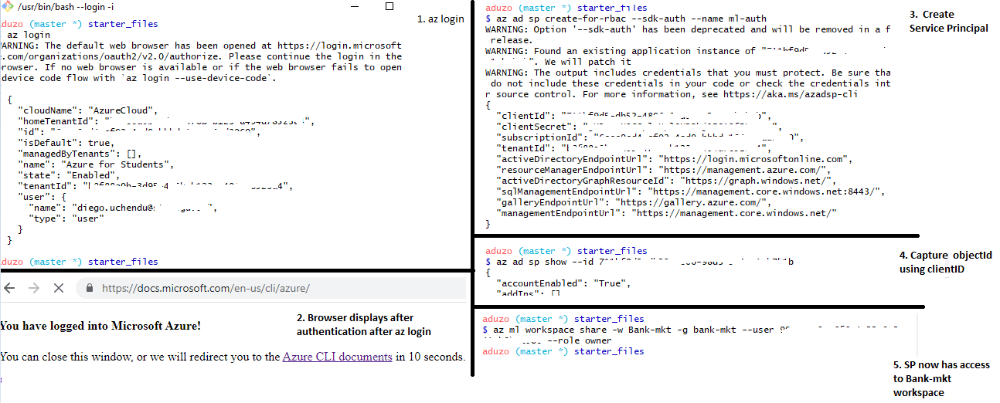

**Automated ML Experiment**

*  First clone starter files
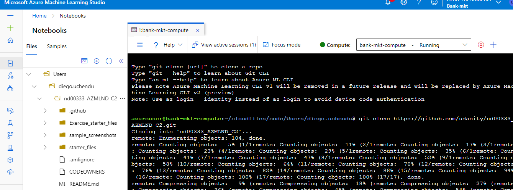

* Dataset Registered
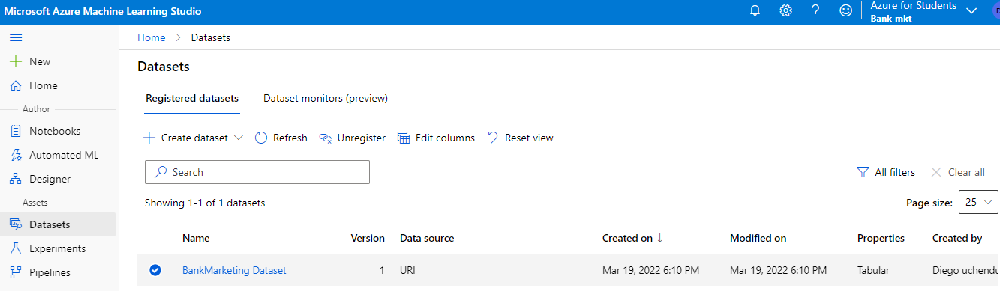

* Experiment Completed and Best Model

The Best model for this experiment is VotingEnsemble

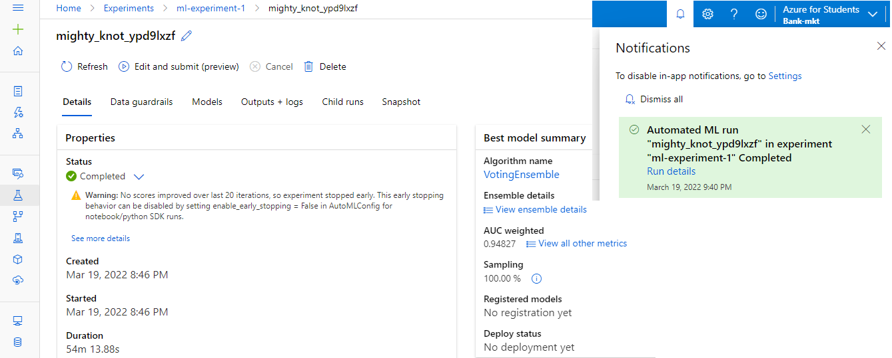
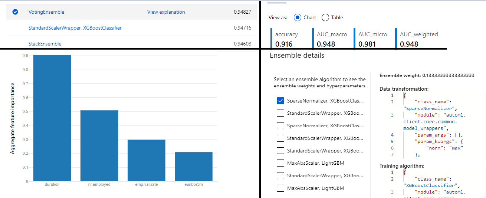

**Deploy the Best Model**

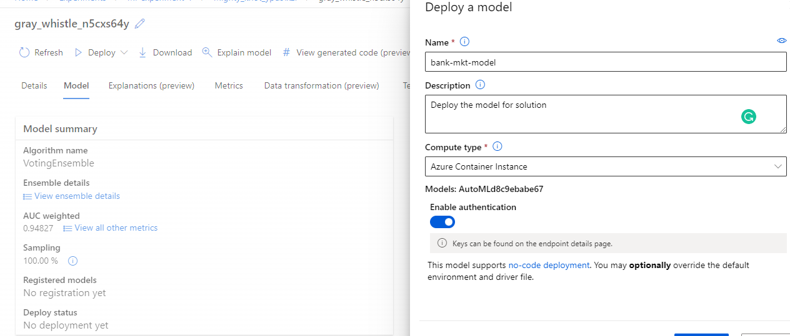
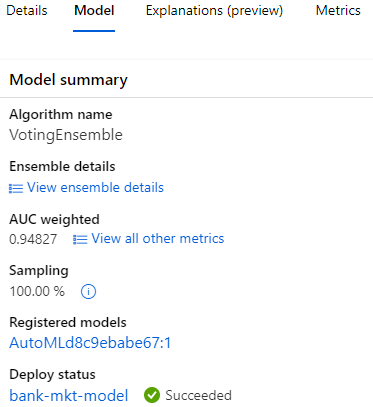

**Enable Logging**

Enable Application Insights gives us information about how the deployed services is behaving.

* Download Config file from Azure ML sdk


config.json content

```json
{
    "subscription_id": "xxxxxxxxxx",
    "resource_group": "bank-mkt",
    "workspace_name": "Bank-mkt"
}
```

these contents will be used by ```py Workspace.from_config() ``` in the logs.py

* Write a python script to set deployment name to load web service and application insights to True.

```python
#logs.py

from azureml.core import Workspace
from azureml.core.webservice import Webservice

# Requires the config to be downloaded first to the current working directory
ws = Workspace.from_config()

# Set with the deployment name
name = "bank-mkt-model"

# load existing web service
service = Webservice(name=name, workspace=ws)

# enable application insight
service.update(enable_app_insights=True)

logs = service.get_logs()

for line in logs.split('\n'):
    print(line)
```
* Run logs.py file in the terminal to enable application insight

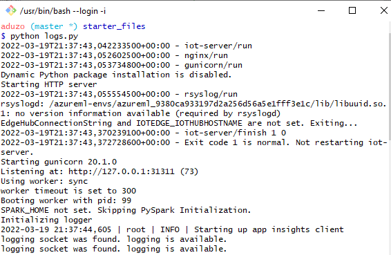
* Application insight enabled

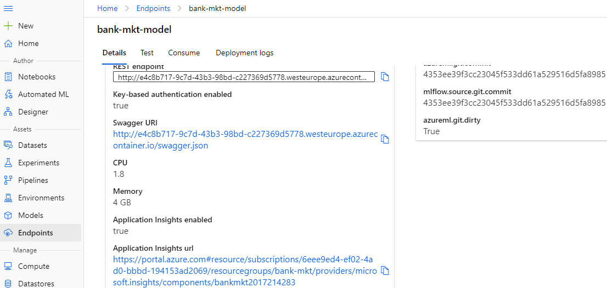

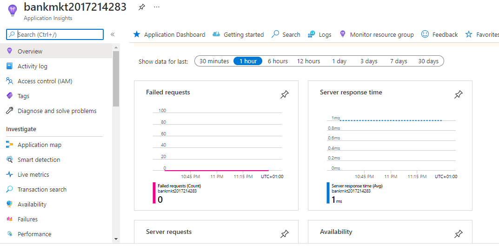
  
**Swagger Documentation**

Consume the deployed model using Swagger.
Documentation is a core pillar of operations.

* Makes documentation easier by explaining:

  * What the API accepts:HTTP POST and GET requests
  * What types of inputs
  * What are the endpoints
* Easier and more confident interaction


```sh
#swagger.sh
docker pull swaggerapi/swagger-ui
docker run -p 9000:8080 swaggerapi/swagger-ui
```

* run swagger.sh

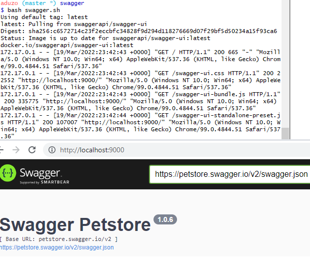

* Swagger interactions

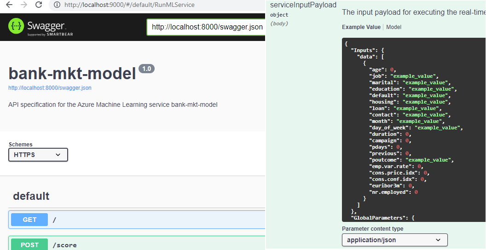

**Consume Model Endpoints**

## Screen Recording
*TODO* Provide a link to a screen recording of the project in action. Remember that the screencast should demonstrate:

## Standout Suggestions
*TODO (Optional):* This is where you can provide information about any standout suggestions that you have attempted.
