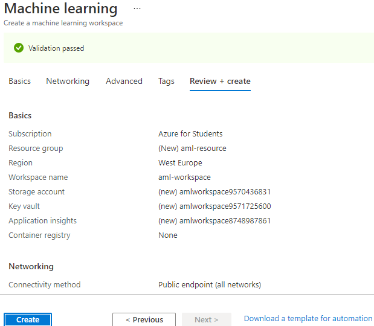
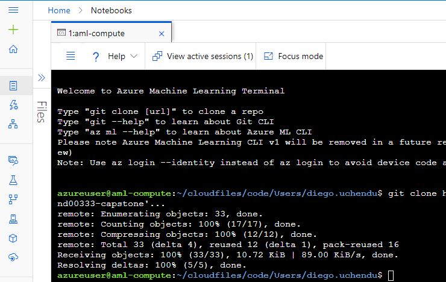
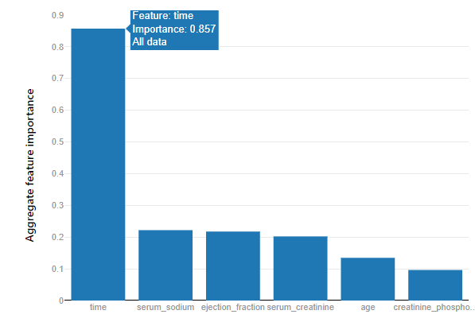

# Predicting mortality by heart failure using Microsoft Azure
An Udacity Project part of the Machine Learning Engineer with Microsoft Azure Nanodegree program. 
I will start by getting the Heart failure dataset into Azure datastore, then create 2 models, one using AutoML and the other using HyperDrive,Compare there performance, Deploy Best Model and Test Model End Point.


## Project Set Up and Installation

Using my Azure account, I created a machine learning workspace within a Resource group.


Then within Azure ML studio, I have to provision a compute instance Standard_DS3_v2(4 cores,14GB RAM, 28GB storage, cost $0.27/hr)

Next is I created a Notebook,then cloned starter files from github repository via Azure Machine Learning CLI terminal


## Dataset


### Overview

Heart failure is a common event caused by Cardiovascular diseases (CVDs) dataset contains 12 features that can be used to predict mortality by heart failure.[source kaggle](https://www.kaggle.com/datasets/andrewmvd/heart-failure-clinical-data)

### Task
*TODO*: Explain the task you are going to be solving with this dataset and the features you will be using for it.
This is a binary classification problem to predict "DEATH_EVENT". 

### Access

The csv data from kaggle was uploaded to Azure datastore. then I created a tabular dataset on the datastore, before registering the tabular dataset.

```python
default_ds = ws.get_default_datastore()

#FileDatasetFactory.upload_directory
if 'Heart Failure' not in ws.datasets:
    default_ds.upload_files(files=['./heart_failure_clinical_records_dataset.csv'], # Upload the diabetes csv files in /data
                        target_path='data/', # Put it in a folder path in the datastore
                        overwrite=True, # Replace existing files of the same name
                        show_progress=True)

    #Create a tabular dataset from the path on the datastore (this may take a short while)
    tab_data_set = Dataset.Tabular.from_delimited_files(path=(default_ds, 'data/*.csv'))

    # Register the tabular dataset
    try:
        tab_data_set = tab_data_set.register(workspace=ws, 
                                name='Heart Failure',
                                description='Clinic data',
                                tags = {'format':'CSV'},
                                create_new_version=True)
        print('Dataset registered.')
    except Exception as ex:
        print(ex)
else:
    print('Dataset already registered.')
```

After registeration is done, you can now access the datastore using registered name.

```python
heart_ds = ws.datasets.get("Heart Failure")
```

## Automated ML
*TODO*: Give an overview of the `automl` settings and configuration you used for this experiment

AutoML is used to train and tune a model.

* This is a classification task as we want to predict is someone will die of heart failure or not, thus label_column_name is "DEATH_EVENT".
* maximum time for the experiment was set to 15 minutes
* primary metric for classification here is AUC_Weighted, used to optimize for model selection.
* featurization, data imputation, one-hot-encoding,e.t.c will be performed automatically or not.
* 5 max concurrt iterations is set, But I provisioned maximum of 2 nodes for my compute cluster, thus other runs will be queued.
* early stopping is true, thus we can terminate  is no improvement in short term.
* debug_log, the log file to write debug information is specified here.
* training and validation data are specified there, respectively.
  
```python
#from azureml.train.automl import AutoMLConfig

# TODO: Put your automl settings here
automl_settings = {
    "experiment_timeout_minutes": 15,
    "max_concurrent_iterations": 5,
    "primary_metric" : 'AUC_weighted'
}

# TODO: Put your automl config here
automl_config = AutoMLConfig(compute_target=training_cluster,
                             task = "classification",
                             training_data=train_ds,
                             validation_data = test_ds,
                             label_column_name="DEATH_EVENT",   
                             #path = experiment_folder,
                             enable_early_stopping= True,
                             featurization= 'auto',
                             debug_log = "automl_errors.log",
                             **automl_settings

)
```

### Results

**AutoML results**

After runing the AutoML model for 15 minutes, Result shows weighted AUC and Accuracy.

|AUC|Accuracy|
|--|--|
|0.952|0.88|

This result above can be improved by increasing the experiment timeout minutes parameter in `AutoMLConfig`.

*TODO* Remeber to provide screenshots of the `RunDetails` widget as well as a screenshot of the best model trained with it's parameters.

The diagrams below shows the `RunDetails`widgets of machine learning pipelines and AUC_weighted while the experiment was still running.


best model trained is VotingEnsemble with it's parameters.


7 ensemble algorithms where involved in training. It takes the parameters of th ensemble algorithm.
e.g. logistic regression as one of the ensemble algorithm applied 4 parameters for training.

```json
{
    "class_name": "LogisticRegression",
    "module": "sklearn.linear_model",
    "param_args": [],
    "param_kwargs": {
        "C": 0.3906939937054613,
        "class_weight": null,
        "multi_class": "ovr",
        "penalty": "l1",
        "solver": "saga"
    },
    "prepared_kwargs": {},
    "spec_class": "sklearn"
}
```


Time is the most important feature for predicting death by heart failure with feature importance of 0.857.


## Hyperparameter Tuning

**Model for this experiment**

I used Adaboost classifier with decision Tree classifier as it's base model.

```python
model = AdaBoostClassifier(base_estimator = DecisionTreeClassifier(max_depth=3),random_state=42,learning_rate=args.learning_rate,n_estimators=args.n_estimators).fit(X_train, y_train)
```
`max_depth` was limited to  3, to avoid overfitting.

reason for using adaboost with decision tree classiers is that  AdaBoost is best used to boost the performance of decision trees on binary classification problems[Source:AdaBoost for Machine Learning](https://machinelearningmastery.com/boosting-and-adaboost-for-machine-learning/)


**Types of parameters**

I optimized for 2 parameters in AdaBoostClassier which are learning rate and number of estimators.

These parameters are defined within a search space, learning rate was  defined with continous hyperparameters using uniform distribution ranging from 0.05 to 0.1. while number of estimators was defined with discrete hyperparameters using a choice which provides list of 4 values for tuning.
For hyperparameter tuning using Azure hyperdrive,

```python
RandomParameterSampling(
    {
        # Hyperdrive will try combinations, adding these as script arguments
        '--learning_rate': uniform(0.05, 0.1),
        '--n_estimators' : choice(50,75,100,150)
    }
```
Random sampling handles the defined search space by selecting parameters at random while mixing learning rate and number of estimators parameters.

### Results

* hyperdrive results

|AUC|Accuracy|
|--|--|
|0.927|0.83|

* parameters of the model.

|learning_rate|n_estimators|
|--|--|
|0.08078531408967735|75|

* How to improve.
    * Using Bayesian sampling which considers the previous parameter performance before making another selection.
    * Increasing the search space with Grid sampling can help but this can take more time.
    * compare various different base algorithms for AdaBoostClassifier like logistic regression,decision tree, SVC and select the best.

RunDetals going through different parameters


Best Model with parameters


Best Models registered


## Model Deployment

AutoML model was deployed as it has the higher metrics for both AUC and Accuracy.

|Trained with|AUC|Accuracy|
|--|--|--|
|AutoML|0.952|0.88|
|HyperDrive|0.927|0.83|

The Model will be deployed as a service consist of: entry_script and environment:
* Entry_script loads the model and return predictions when data is submitted.
* environment is here the script will run. 
[source: Microsoft Learn Deploy Model](https://docs.microsoft.com/en-us/learn/modules/register-and-deploy-model-with-amls/2-deploy-model)

score.py which is the entry script consists mainly of 2 functions,init() which load the model from the model registry and run(raw_data) generates predictions from the input data.

In Microsoft Azure Machine Learning Studio,the score file was downloaded from `experiment->Child runs->click on the latest child runs->Outputs + logs ->outputs/scoring_file_v_1_0_0.py`

```python
#best_run, fitted_model = remote_run.get_output()

script_file_name = 'inference/score.py'
#download file from our latest run from outputs/scoring_file_v_1_0_0.py to inference/score.py
best_run.download_file("outputs/scoring_file_v_1_0_0.py",script_file_name)
```


The environment is where the service to run th entry script. I downloaded conda environment file
```python
## Use the below to prevent the 'No usable environment found' error
## download a yml file
from azureml.core.environment import Environment
from azureml.automl.core.shared import constants

# download from conda environment and save to myenv.yml
best_run.download_file(constants.CONDA_ENV_FILE_PATH, 'myenv.yml')

# create an Environment instance
myenv = Environment.from_conda_specification(name="myenv", file_path="myenv.yml")
```

The endpoint service should be deployed with specific compute configuration
```python
from azureml.core.webservice import AciWebservice,Webservice
from azureml.core.model import InferenceConfig
from azureml.core.model import Model
from azureml.core.environment import Environment

inference_config = InferenceConfig(entry_script=script_file_name ,environment=myenv)

# What kind of configuration will our endpoint be hosted on?
deployment_config = AciWebservice.deploy_configuration(cpu_cores = 2, memory_gb = 4,description="Heart failure classification")

service_name = "heart-service"

service = Model.deploy(ws, service_name, [model], inference_config, deployment_config,overwrite=True)

service.wait_for_deployment(True)
print(service.state)
```
AutoML endpoint healthy


**Query endpoint**

Before querying a model endpoint, we have to extract the endpoint.
Then define content type, 

```python

import requests
import urllib.request
import json

endpoint = service.scoring_uri
#list of data
x_new=train_ds.to_pandas_dataframe().iloc[0:3,0:12]

# Convert the array to a serializable list in a JSON document)
input_json=str.encode(json.dumps({'data': x_new.to_dict(orient='records')}))

# Set the content type
headers = { 'Content-Type':'application/json' }

req = urllib.request.Request(endpoint, input_json, headers = headers)

try:
    response = urllib.request.urlopen(req)

    result = response.read()
    print(result)
except urllib.error.HTTPError as error:
    print("The request failed with status code: " + str(error.code))

    # Print the headers - they include the requert ID and the timestamp, which are useful for debugging the failure
    print(error.info())
    print(error.read().decode("utf8", 'ignore'))

```

Alternatively tools like postman can be useful in seeing how endpoints are consumed.


The input data for the heart failure dataset is provided in json format.

```json
{
    "data":[
        {
        "age":75,
        "anaemia":0,
        "creatinine_phosphokinase":582,
        "diabetes":0,
        "ejection_fraction":20, 
        "high_blood_pressure":1, 
        "platelets":265000,
        "serum_creatinine":1.9, 
        "serum_sodium":130, 
        "sex":1, 
        "smoking":0, 
        "time":4
        }
    ]
  }
```


## Screen Recording

[Screen recording](https://youtu.be/FyO7d5RUqPw)

**Hyperparameters**

* Data Transformation
```json
{
    "class_name": "MaxAbsScaler",
    "module": "sklearn.preprocessing",
    "param_args": [],
    "param_kwargs": {},
    "prepared_kwargs": {},
    "spec_class": "preproc"
}
```

* Training Algorithm
```json
{
    "class_name": "RandomForestClassifier",
    "module": "sklearn.ensemble",
    "param_args": [],
    "param_kwargs": {
        "bootstrap": true,
        "class_weight": "balanced",
        "criterion": "gini",
        "max_features": "log2",
        "min_samples_leaf": 0.06157894736842105,
        "min_samples_split": 0.10368421052631578,
        "n_estimators": 25,
        "oob_score": true
    },
    "prepared_kwargs": {},
    "spec_class": "sklearn"
}

```
## Standout Suggestions

**Application Insight**

```python

from azureml.core import Workspace
from azureml.core.webservice import Webservice

# Requires the config to be downloaded first to the current working directory
ws = Workspace.from_config()

# Set with the deployment name
name = "heart-service"

# load existing web service
service = Webservice(name=name, workspace=ws)

# enable application insight
service.update(enable_app_insights=True)

logs = service.get_logs()

for line in logs.split('\n'):
    print(line)
```


## References

1. [Udacity ML Engineer for microsoft azure nanodegree](https://www.udacity.com/course/machine-learning-engineer-for-microsoft-azure-nanodegree--nd00333)
2. [Kaggle Dataset](https://www.kaggle.com/datasets/andrewmvd/heart-failure-clinical-data)
3. [Register Dataset](https://github.com/MicrosoftLearning/mslearn-dp100/blob/main/06%20-%20Work%20with%20Data.ipynb)
4. [AutoMLConfig](https://docs.microsoft.com/en-us/python/api/azureml-train-automl-client/azureml.train.automl.automlconfig.automlconfig?view=azure-ml-py)
5. [OVR vs OVO](https://machinelearningmastery.com/one-vs-rest-and-one-vs-one-for-multi-class-classification/)
6. [Microsoft Learn AutoML](https://github.com/MicrosoftLearning/mslearn-dp100/blob/main/12%20-%20Use%20Automated%20Machine%20Learning.ipynb)
7. [Microsoft Learn Tune hyperparameters](https://docs.microsoft.com/en-us/learn/modules/tune-hyperparameters-with-azure-machine-learning/)
8. [AdaBoost for Machine Learning](https://machinelearningmastery.com/boosting-and-adaboost-for-machine-learning/)
9. [AdaBoost Classifier](https://scikit-learn.org/stable/modules/generated/sklearn.ensemble.AdaBoostClassifier.html)
10. [Video Register and Deploy Model](https://youtu.be/5P9VjdaV8J4)
11. [Git Register and Deploy Model](https://github.com/jwood803/AzureMLExamples/blob/master/Register%20and%20Deploy.ipynb)
12. [Microsoft Learn Deploy Model](https://docs.microsoft.com/en-us/learn/modules/register-and-deploy-model-with-amls/2-deploy-model)
13. [Real time inference service](https://github.com/MicrosoftLearning/mslearn-dp100/blob/main/09%20-%20Create%20a%20Real-time%20Inferencing%20Service.ipynb)